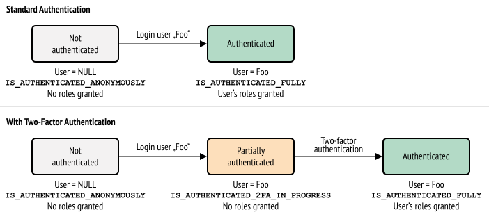

SchebTwoFactorBundle
====================

This bundle provides **two-factor authentication (2FA) for Symfony applications**.

Documentation Index
-------------------

* :doc:`Installation </installation>`
* :doc:`Configuration Reference </configuration>`
* :doc:`Trusted Devices </trusted_device>`
* :doc:`Backup Codes </backup_codes>`
* :doc:`Brute Force Protection </brute_force_protection>`
* :doc:`CSRF Protection </csrf_protection>`
* :doc:`Events </events>`
* :doc:`Troubleshooting (common issues) </troubleshooting>`

How-to's
~~~~~~~~

* :doc:`How to create a custom two-factor provider </providers/custom>`
* :doc:`How to handle multiple activated authentication methods </multi_authentication>`
* :doc:`How to customize conditions when to require two-factor authentication </custom_conditions>`
* :doc:`How to configure two-factor authentication for an API </api>`
* :doc:`How to create a custom persister </persister>`
* :doc:`How to use a different template per firewall </firewall_template>`

.. admonition:: Screencast
    :class: screencast

    Do you prefer video tutorials? Check out the `Two-Factor Authentication <https://symfonycasts.com/screencast/symfony-security/scheb-2fa>`_
    screencasts from SymfonyCasts.

Two-Factor Authentication Methods
~~~~~~~~~~~~~~~~~~~~~~~~~~~~~~~~~

The bundle supports the following authentication methods out of the box:

* :doc:`Google Authenticator </providers/google>`
* :doc:`TOTP Authenticator </providers/totp>`
* :doc:`Code-via-Email authentication </providers/email>`

The Authentication Process with Two-Factor Authentication
---------------------------------------------------------

**What changes when you add two-factor authentication to your application?**

The bundle hooks into the security layer and listens for authentication events. When a user login appears and the user has
two-factor authentication enabled, access and privileges are temporarily withheld, putting the authentication status
into an intermediate state. The user is challenged to enter a valid two-factor authentication code. Only when that code
is entered correctly, the associated roles are granted.

To represent the state between login and a valid two-factor code being entered, the bundle introduces the role-like
attribute ``IS_AUTHENTICATED_2FA_IN_PROGRESS``, which can be used in ``is_granted()`` calls. ``IS_AUTHENTICATED_FULLY``
is – just like roles – withheld until the two-factor authentication step has been completed successfully.

Contributing
------------
Want to contribute to this project? See
`CONTRIBUTING.md <https://github.com/scheb/2fa/blob/5.x/CONTRIBUTING.md>`_ in the repository.

Security
--------
For information about the security policy and know security issues, see
`SECURITY.md <https://github.com/scheb/2fa/blob/5.x/SECURITY.md>`_ in the repository.

License
-------
**SchebTwoFactorBundle** is available under the `MIT license <https://github.com/scheb/2fa/blob/5.x/LICENSE>`_.
